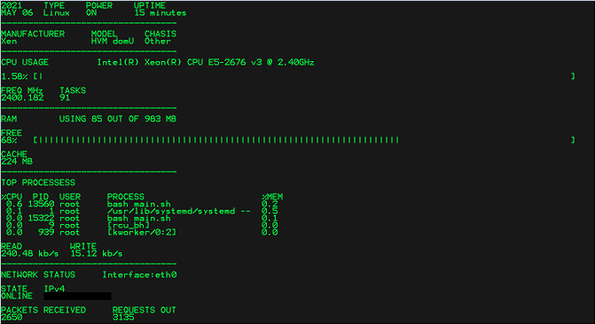

# termon

termon is terminal resource monitoring tool



## Installation

run this command -

```
wget https://raw.githubusercontent.com/YashIndane/termon/main/termon_install.sh ; bash termon_install.sh
```

Use by running `termon`
